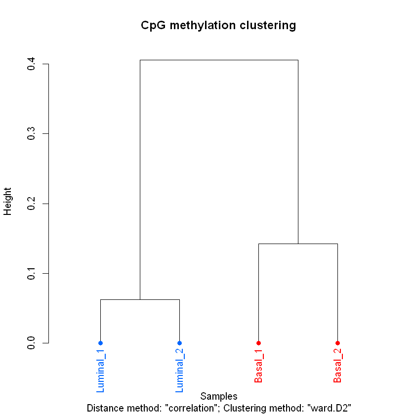
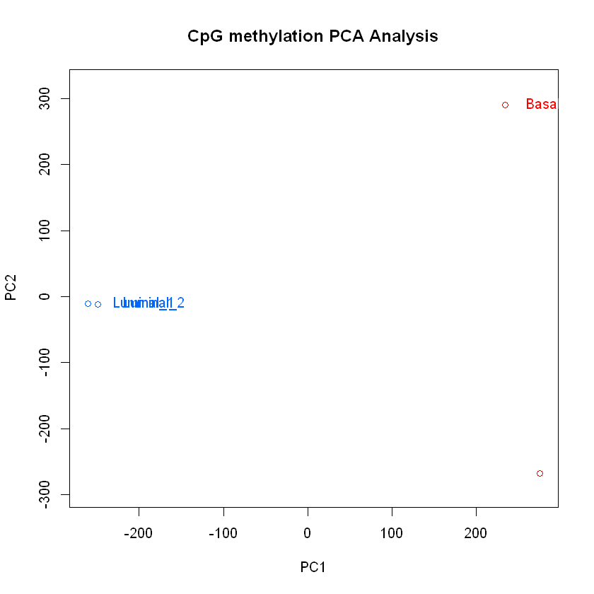
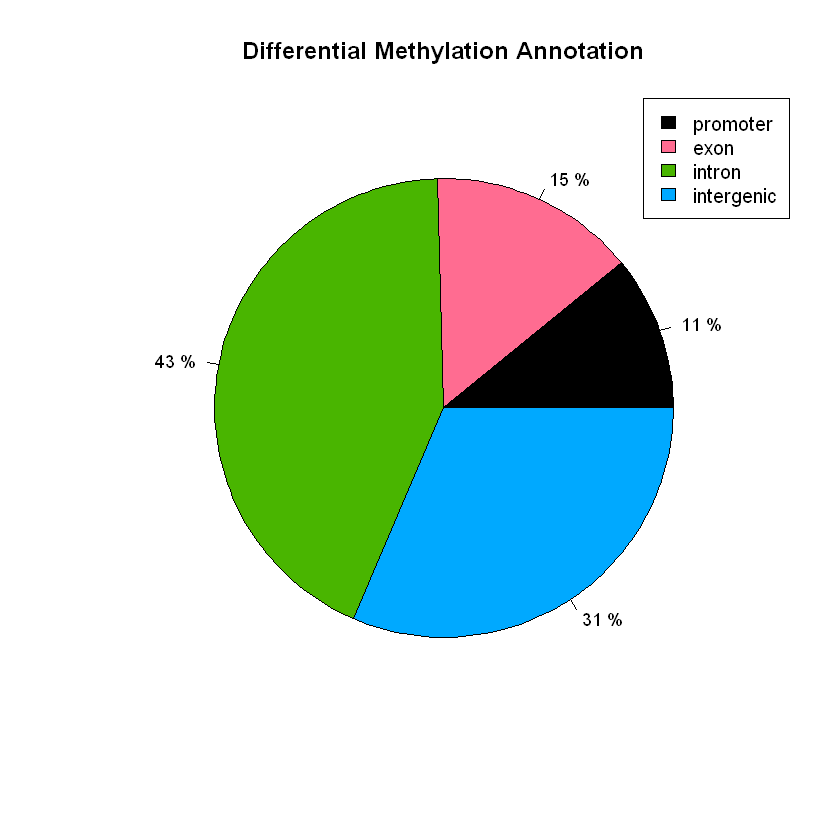
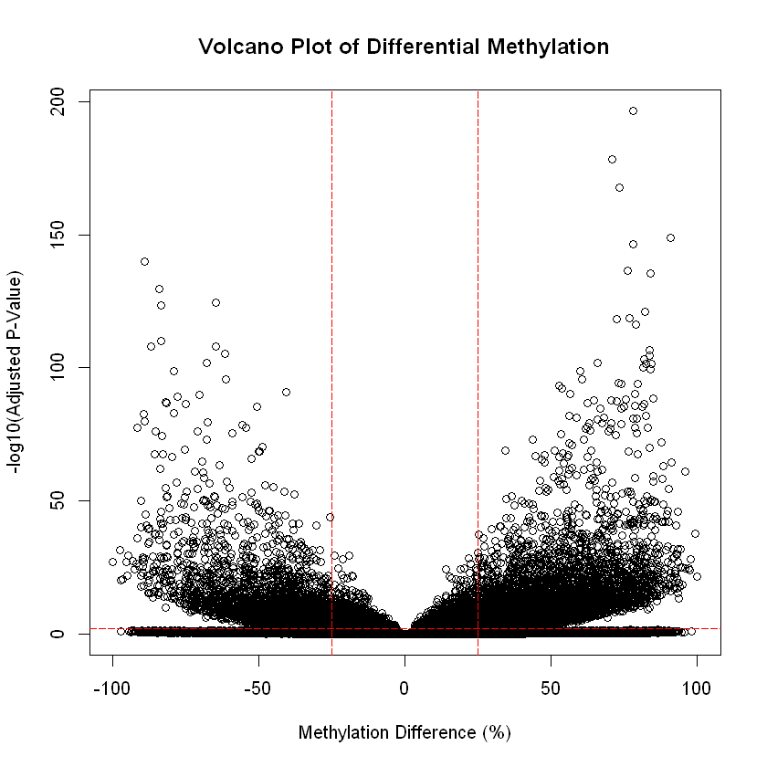

# Differential DNA Methylation Analysis (Bisulfite-Seq)

This project analyzes DNA methylation differences in mouse mammary gland epithelial cells using bisulfite sequencing data processed with [**methylKit**](https://bioconductor.org/packages/release/bioc/html/methylKit.html) and [**genomation**](https://bioconductor.org/packages/release/bioc/html/genomation.html) in R.

The dataset includes basal and luminal cell types, with basal cells further divided by Itga5 surface marker expression. The goal is to identify differentially methylated CpG sites and regions, and annotate them with genomic features.

## Dataset

* **Samples**: 4 in total
  * Basal Itga5+: `P8_3.bismark.cov`, `P8_6.bismark.cov`
  * Luminal: `P6_1.bismark.cov`, `P6_4.bismark.cov`
* **Source**: Bismark coverage files (from `.fastq` aligned to `mm10` with Bowtie2)

## Workflow Summary

### 1. **Data Loading**

* Imported `.cov` files using `methRead`
* Assigned treatments (control vs. test)

### 2. **Quality Control**

* Inspected methylation and coverage distributions
* Filtered CpGs: removed low (<10 reads) and high (>99.9%) coverage outliers
* Normalized coverage across samples

### 3. **Data Merging & Filtering**

* Retained CpGs common to all samples (`unite`)
* Removed CpGs with low variance (SD < 2%)
* Filtered out C→T SNPs using `GRanges` coordinates

### 4. **Exploratory Analysis**

* Sample correlations and hierarchical clustering
* Principal Component Analysis (PCA)

### 5. **Differential Methylation**

* Used logistic regression or Fisher’s test (`calculateDiffMeth`)
* Generated volcano plot of differential CpG sites
* Identified hyper/hypomethylated CpGs (Δmethylation >25%, q < 0.01)

### 6. **Annotation**

* Annotated CpGs with gene features (`RefSeq` BED)
* Annotated with CpG islands and shores
* Summarized hits by feature class (e.g., intron, exon, promoter)

### 7. **Regional and De-novo Analysis**

* Differentially methylated regions (DMRs) from CpG islands
* De-novo windowed approach using 1kb tiles

## Interpretation

* PCA and hierarchical clustering based on CpG methylation ratios reveal distinct epigenetic signatures between luminal and basal mammary epithelial subtypes. PC1 accounts for the majority of variance and separates the subtypes, while PC2 captures variability within the basal group.
  

  
  

* Differential Methylation Annotation: The pie chart summarizes the genomic locations of significantly hypermethylated CpG sites (Δmethylation ≥ 25%, q < 0.01). Most sites fall within intronic (43%) and intergenic (31%) regions, with smaller proportions in exons (15%) and promoter regions (11%). This distribution was generated using `plotTargetAnnotation()` on annotated CpGs from `methylKit`.

  

* The volcano plot displays differentially methylated CpG sites between basal and luminal cells (q < 0.01, Δmethylation > 25%). Numerous loci exceed both statistical and biological thresholds, with symmetrical distribution of hyper- and hypomethylated sites.

  

---

## Repository Structure

| File/Folder              | Description                                                     |
| ------------------------ | --------------------------------------------------------------- |
| `TrGe_BisulfitSeq.ipynb` | Jupyter notebook with all code and answers                      |
| `*.png` or `*.jpeg`      | PCA, volcano, annotation, and cluster plots (add to repo)       |

---

## Requirements

* R ≥ 4.0
* Bioconductor: `methylKit`, `genomation`, `GenomicRanges`
* Optional: `matrixStats`, `ggplot2`, `IRanges`

---
